# NN-CNN_proj
Implement NN and CNN only with numpy and compare performance with open libraries.

## 1. NN with Python

### Loss Graph
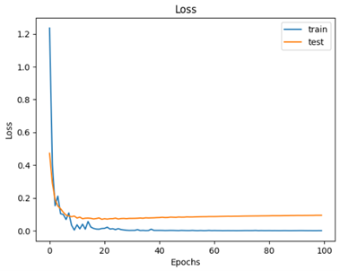

### Confusion Matrix
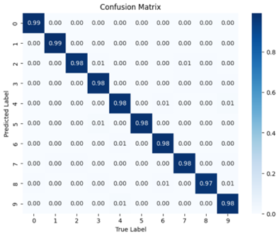

### Top 3 Score Images (All Classes)
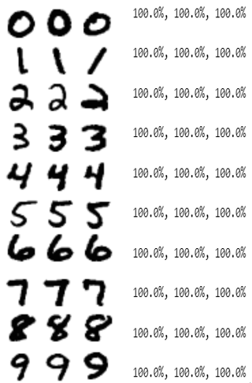

## 2. NN with DL Framework

### Loss Graph
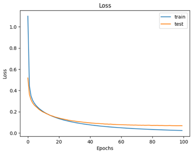

### Confusion Matrix
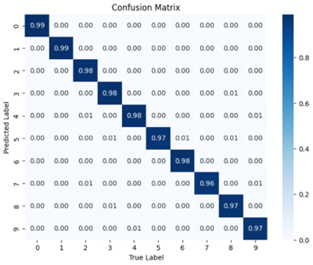

### Top 3 Score Images (All Classes)
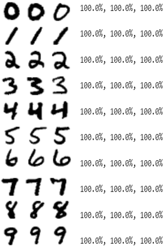

## 3. CNN with Python

### Loss Graph
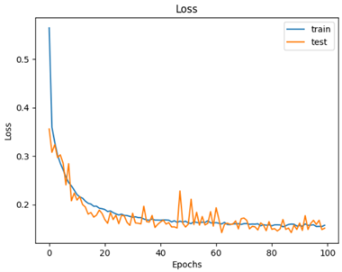

### Confusion Matrix
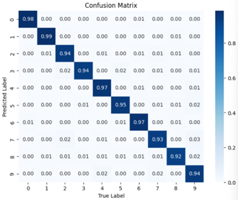

### Top 3 Score Images (All Classes)
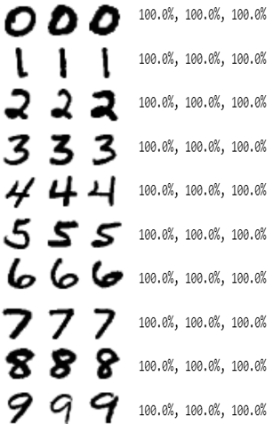

## 4. CNN with DL Framework

### Loss Graph
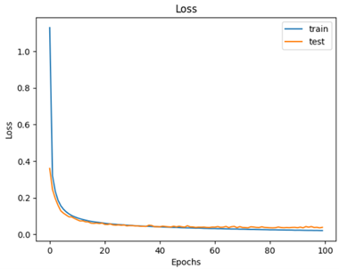

### Confusion Matrix
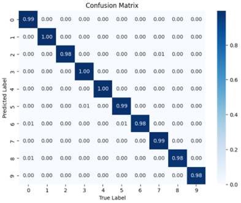

### Top 3 Score Images (All Classes)
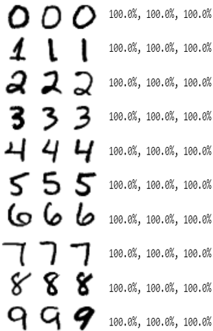
